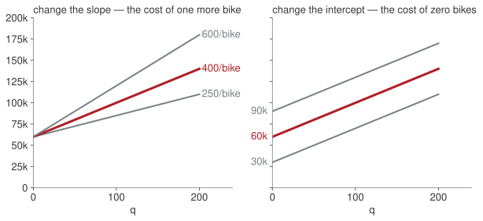
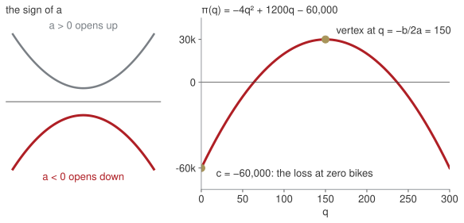

## Who I am

:::: {.columns}
::: {.column width="28%"}
{width="100%"}
:::
::: {.column width="72%"}
**Niccolò Salvini, PhD** · Adjunct Professor

::: {.incremental}
- **Economics**, Florence
- **MSc, Statistical and Actuarial Sciences**, Milan
- **PhD, Healthcare Data Science**, Rome
- **Founder, Intuo** — data pipelines and AI for companies
- **Adjunct Professor** — Università Cattolica, and ESE
:::

[I use the mathematics of these five weeks for a living. That is the only reason it is in the room.]{.muted}
:::
::::

## Where the ten weeks go

:::: {.columns}
::: {.column width="58%"}
| Wk | Date | What you will be able to do by hand |
|---|---|---|
| 1 | 24 Sep | equations, systems, quadratics, logs |
| 2 | 1 Oct | read a function; limits; the derivative |
| 3 | 8 Oct | study a function; optimise; integrate |
| 4 | 15 Oct | interest, discounting, NPV |
| 5 | 22 Oct | bonds, duration, convexity; mock exam |
| 6–10 | from 2 Nov | **Vincenzo Nardelli, PhD** — probability, statistics, regression |

: {tbl-colwidths="[12,18,70]"}
:::
::: {.column width="42%"}
**Two things count.**

Midterm (25%): a report to a Board built on the study of a cost, a revenue and a profit function. Due 1 Nov.

Final exam (75%): 3 hours, paper, calculator. One of five questions is pure calculus: integrals, limits, recovering a function from its derivative.
:::
::::

[Every technique in weeks 1–3 is here because one of those two asks for it. I will tell you which one, every time.]{.red}

## The map — come back to this every week

{fig-align="center" width="100%"}

## How every session runs

::: {.blocks .four}
::: {.blk .recap}
[10:00 · 15']{.blk-letter}Your homework, at the board[One of you walks us through one exercise. From week 2.]{.blk-answer}
:::
::: {.blk .recap}
[10:15 · 5']{.blk-letter}Last week, in one minute[The questions we answered, and the answers.]{.blk-answer}
:::
::: {.blk .now}
[10:20 → 12:45]{.blk-letter}Today's blocks[Each one: a business question and your bet → the picture → the technique → exercises on paper. Break at half time.]{.blk-tool}
:::
::: {.blk .recap}
[12:45 · 15']{.blk-letter}Take home[Three lines to remember, and the homework for next Thursday.]{.blk-answer}
:::
:::

[Homework is not graded. It is read, discussed at the board, and it is the best preparation for the midterm.]{.muted}

## The shape of an exam item

:::: {.columns}
::: {.column width="50%"}
**Same form as the final, different numbers:**

$$\int \frac{x^{5} - 3x^{3} + 2}{x^{2}}\,dx$$
$$\lim_{x \to 1^{+}} \frac{(x-1)^{2}}{x - x^{2}}$$
$$f'(x) = 6x^{2} - 2x,\quad f(1) = 4 \;\Rightarrow\; f(x) = ?$$
:::
::: {.column width="50%"}
Today we do none of this. Today we make sure that when we get there, the *algebra* underneath — dividing term by term, factoring, solving for an unknown, handling a log — is not what slows you down.

Everything today is a question the founder of a small firm actually has to answer.
:::
::::

## The case: Arno Bikes

::: {.bigtable}
| | |
|---|---|
| **e-bike assembler, Florence** | |
| Fixed cost | €60,000 per month (rent, salaries, insurance) |
| Variable cost | €400 per bike (parts, packaging) |
| List price | €1,000 per bike |
:::

## Four questions from the founder {.hub auto-animate=true}

::: {.blocks}
::: {.blk .now data-id="blkA"}
[Block A]{.blk-letter}How many bikes before we stop losing money?[linear equations · systems]{.blk-tool}
:::
::: {.blk .next}
[Block B]{.blk-letter}How many bikes should we make?[quadratics]{.blk-tool}
:::
::: {.blk .next}
[Block C]{.blk-letter}How long until revenue doubles?[exponentials · logarithms]{.blk-tool}
:::
::: {.blk .next}
[Block D]{.blk-letter}Is this battery cell within spec?[absolute value]{.blk-tool}
:::
:::

## [Block A · linear equations and systems]{.section-kicker} How many bikes before we stop losing money? {.section-slide background-color="#AF1F25" auto-animate=true}

::: {.blk-fill data-id="blkA"}
:::

## How many bikes a month before Arno Bikes stops losing money?

:::: {.columns}
::: {.column width="52%"}
Two facts, written as two functions of the monthly quantity $q$:

$$C(q) = 60{,}000 + 400\,q$$
[what it costs to make $q$ bikes]{.muted}

$$R(q) = 1{,}000\,q$$
[what selling them brings in]{.muted}

::: {.callout-important title="Bet before we compute"}
Write a number. Do not compute yet.
:::
:::
::: {.column width="48%" .fragment}
::: {.bigtable}
| bikes $q$ | cost $C(q)$ | revenue $R(q)$ | |
|---:|---:|---:|---|
| 50 | 80,000 | 50,000 | [losing]{.red} |
| 80 | 92,000 | 80,000 | [losing]{.red} |
| **?** | | | **even** |
| 120 | 108,000 | 120,000 | making money |
| 150 | 120,000 | 150,000 | making money |
:::

Break-even is where the two meet:
$$R(q) = C(q)$$
:::
::::

## Two lines and a crossing

:::: {.columns}
::: {.column width="55%"}

:::
::: {.column width="45%"}
$$1{,}000\,q = 60{,}000 + 400\,q$$
$$600\,q = 60{,}000$$
$$q^{*} = \frac{60{,}000}{600} = 100$$

**Reading.** €600 is the *contribution* of each bike. Break-even is fixed cost ÷ contribution.
:::
::::

## How to read a line

{fig-align="center" width="100%"}

:::: {.columns}
::: {.column width="50%"}
$$C(q) = \underbrace{60{,}000}_{\text{intercept}} + \underbrace{400}_{\text{slope}}\,q$$
:::
::: {.column width="50%"}
**Intercept**: the value at $q = 0$ — here, the rent you pay with the factory idle.
**Slope**: what one more unit adds — here, the parts in one bike.
:::
::::

## Move the price. Then raise the rent. {.lab background-color="#2471A3"}

[LAB · session.ipynb § A]{.kicker}

1. Bet: what price makes break-even 50 bikes? Then slide.
2. The landlord raises fixed cost to €72,000. Before running: what happens to the cost line, and to the crossing?

Watch the *slope* and the *intercept* separately. Only one of them moved.

## A cost shock is a parallel shift — remember this for the midterm

:::: {.columns}
::: {.column width="55%"}

:::
::: {.column width="45%"}
Same slope (€400 per bike), higher intercept.

New break-even: $1{,}000q = 72{,}000 + 400q \Rightarrow q^{*} = 120$.

[The midterm asks how a tariff on an input changes the cost and profit *schedules*. That is this picture with different names: a per-unit tariff changes the slope, a lump-sum cost changes the intercept.]{.red}
:::
::::

## The whole market: two facts, two unknowns

:::: {.columns}
::: {.column width="55%"}
Across Tuscany, at a price $p$:

- buyers want $Q_d = 1200 - 2p$ bikes
- sellers offer $Q_s = -300 + 3p$ bikes

::: {.callout-important title="Bet before we compute"}
At what price do buyers want exactly what sellers offer?
:::

::: {.fragment}
**Set them equal** (substitution):

$$1200 - 2p = -300 + 3p \;\Rightarrow\; p^{*} = 300,\; Q^{*} = 600$$

[One equation is one fact about the business. Two unknowns need two facts.]{.red}
:::
:::
::: {.column width="45%"}
{width="100%"}

[By elimination: $Q + 2p = 1200$ and $Q - 3p = -300$; subtract to get $5p = 1500$. Same answer.]{.muted style="font-size:.7em"}
:::
::::

## An equation answers "where". An inequality answers "from where on".

$$1{,}000q = 60{,}000 + 400q \;\Rightarrow\; q = 100 \qquad\qquad 1{,}000q \geq 60{,}000 + 400q \;\Rightarrow\; q \geq 100$$

The first is the break-even point. The second is **the condition for not losing money** — and it is the second one a Board asks for.

[One rule, and it is the only one that costs marks: multiplying or dividing an inequality by a **negative** number reverses it.]{.red}

## D1, D2, D3b (core) — D3 (stretch) {.paper background-color="#eceff0"}

[PAPER · drills.md]{.kicker}

10 minutes. Show all work, exam style. I come round.

## Four questions from the founder {.hub auto-animate=true}

::: {.blocks}
::: {.blk .done}
[Block A]{.blk-letter}How many bikes before we stop losing money?[linear equations · systems]{.blk-tool}
:::
::: {.blk .now data-id="blkB"}
[Block B]{.blk-letter}How many bikes should we make?[quadratics]{.blk-tool}
:::
::: {.blk .next}
[Block C]{.blk-letter}How long until revenue doubles?[exponentials · logarithms]{.blk-tool}
:::
::: {.blk .next}
[Block D]{.blk-letter}Is this battery cell within spec?[absolute value]{.blk-tool}
:::
:::

## [Block B · quadratics]{.section-kicker} How many bikes should we make? {.section-slide background-color="#AF1F25" auto-animate=true}

::: {.blk-fill data-id="blkB"}
:::

## Price responds to volume

The founder learns: at €1,000 she sells 150 bikes; every €4 cut sells one more.

$$p(q) = 1600 - 4q$$

Revenue is **price × quantity**: a rectangle whose sides pull in opposite directions.

::: {.callout-important title="Bet before we compute"}
Does selling more *always* bring more revenue? Yes / no, and roughly where it stops.
:::

## The revenue rectangle sweeps out a parabola {.clip background-color="#000000"}

<video class="clipvideo" width="1000" height="562" controls muted loop playsinline data-autoplay preload="auto" poster="media/w01_parabola_poster.png"><source src="media/w01_parabola.mp4" type="video/mp4"></video>

## Revenue, cost, profit

$$R(q) = (1600 - 4q)\,q = 1600q - 4q^{2}$$
$$\pi(q) = R(q) - C(q) = -4q^{2} + 1200q - 60{,}000$$

. . .

**Where is profit zero?** First move, always: divide out the common factor.

$$q^{2} - 300q + 15{,}000 = 0$$
$$q = \frac{300 \pm \sqrt{300^{2} - 4\cdot 15{,}000}}{2} = \frac{300 \pm \sqrt{30{,}000}}{2} \approx 63.4,\;\; 236.6$$

## How to read a parabola

{fig-align="center" width="100%"}

$$y = a\,q^{2} + b\,q + c$$

**$a$** decides the shape: below zero, a hill with a top — a profit that peaks. **$c$** is the value at $q = 0$. The top sits at $q = -b/2a$, halfway between the two roots.

## The discriminant decides before you compute

:::: {.columns}
::: {.column width="48%"}
| $b^{2} - 4ac$ | roots | in business |
|---|---|---|
| $> 0$ | two | a profitable window |
| $= 0$ | one | a single break-even |
| $< 0$ | none | no viable scale |

**Where is profit positive?** A downward parabola ($a<0$) is positive *between* its roots:

$$63.4 < q < 236.6$$
:::
::: {.column width="52%"}

[The sign line. In the midterm it is called "the sign of the profit function".]{.muted style="font-size:.7em"}
:::
::::

## Push the fixed cost up. Where do the two break-evens merge? {.lab background-color="#2471A3"}

[LAB · session.ipynb § B]{.kicker}

1. Bet on the fixed cost at which the roots become one. (Hint: what is the profit at the vertex now?)
2. Then push further. What does "no roots" look like, and what does it mean for the founder?

## The top of the hill, for now

Vertex of $\pi(q) = -4q^{2} + 1200q - 60{,}000$:

$$q_{v} = -\frac{b}{2a} = -\frac{1200}{-8} = 150 \qquad \pi(150) = 30{,}000$$

This formula works for parabolas only.

[Next week you get a tool that finds the top of the hill for *any* curve — a log revenue, a cubic cost, anything. It is called the derivative, and it is the reason this course exists.]{.red}

::: {.callout-tip title="Board sentence"}
A quadratic has two roots, one, or none, and the discriminant tells you which before you compute. In business: a profitable window, a single break-even, no viable scale.
:::

## D4, D5 (core) — D6 (stretch: factor and cancel) {.paper background-color="#eceff0"}

[PAPER · drills.md]{.kicker}

10 minutes. Show all work, exam style. I come round.

## Four questions from the founder {.hub auto-animate=true}

::: {.blocks}
::: {.blk .done}
[Block A]{.blk-letter}How many bikes before we stop losing money?[linear equations · systems]{.blk-tool}
:::
::: {.blk .done}
[Block B]{.blk-letter}How many bikes should we make?[quadratics]{.blk-tool}
:::
::: {.blk .now data-id="blkC"}
[Block C]{.blk-letter}How long until revenue doubles?[exponentials · logarithms]{.blk-tool}
:::
::: {.blk .next}
[Block D]{.blk-letter}Is this battery cell within spec?[absolute value]{.blk-tool}
:::
:::

## [Block C · exponentials and logarithms]{.section-kicker} How long until revenue doubles? {.section-slide background-color="#AF1F25" auto-animate=true}

::: {.blk-fill data-id="blkC"}
:::

## Revenue €1.2M, growing 12% a year

:::: {.columns}
::: {.column width="55%"}
$$R(t) = 1.2 \cdot 1.12^{\,t} \quad \text{(€M, } t \text{ in years)}$$

Each year revenue is multiplied by 1.12. The euros added grow every year: 0.14, then 0.16, then 0.18…

**Linear** growth adds the same **amount** each year.
**Exponential** growth adds the same **percentage**.

::: {.callout-important title="Bet before we compute"}
When does revenue reach €2.4M? Write a number of years.
:::
:::
::: {.column width="45%"}
::: {.bigtable}
| year $t$ | revenue (€M) | added |
|---:|---:|---:|
| 0 | 1.20 | |
| 1 | 1.34 | +0.14 |
| 2 | 1.51 | +0.16 |
| 3 | 1.69 | +0.18 |
| … | … | |
| **?** | **2.40** | |
:::
::::
:::

## Linear versus exponential growth {.clip background-color="#000000"}

<video class="clipvideo" width="1000" height="562" controls muted loop playsinline data-autoplay preload="auto" poster="media/w01_growth_poster.png"><source src="media/w01_growth.mp4" type="video/mp4"></video>

## The unknown is in the exponent

$$1.2 \cdot 1.12^{\,t} = 2.4 \quad\Longrightarrow\quad 1.12^{\,t} = 2$$

No algebra so far reaches $t$. **That is what a logarithm is for:** it answers "to what power?"

. . .

$$\ln\!\left(1.12^{\,t}\right) = \ln 2 \;\Longrightarrow\; t\,\ln 1.12 = \ln 2 \;\Longrightarrow\; t = \frac{0.6931}{0.1133} \approx 6.1 \text{ years}$$

. . .

| rule | reading |
|---|---|
| $\ln(ab) = \ln a + \ln b$ | growth factors multiply, their logs add |
| $\ln(a/b) = \ln a - \ln b$ | a ratio of revenues becomes a difference |
| $\ln a^{k} = k \ln a$ | $k$ years of the same growth: the exponent comes down |
| $\log_{b} x = \ln x / \ln b$ | any base through the calculator's $\ln$ |

## The sanity check you will use in the exam

$$t_{\text{double}} \approx \frac{70}{g_{\%}} \qquad\qquad \frac{70}{12} \approx 5.8$$

Why it works: $\ln 2 \approx 0.69$ and $\ln(1+g) \approx g$ when $g$ is small, so $t = \ln 2 / \ln(1+g) \approx 0.69/g$.

The number $e \approx 2.718$ appears today only as "the base your calculator's $\ln$ uses". In week 4 it becomes continuous compounding and earns its place.

::: {.callout-tip title="Board sentence"}
Whenever the unknown is in the exponent, take logs of both sides. Whenever you see a log, remember it is a question: to what power?
:::

## D7, D8 (core) — D9 (stretch: $5e^{0.03t} = 8$) {.paper background-color="#eceff0"}

[PAPER · drills.md]{.kicker}

12 minutes. Show all work, exam style. I come round.

## Four questions from the founder {.hub auto-animate=true}

::: {.blocks}
::: {.blk .done}
[Block A]{.blk-letter}How many bikes before we stop losing money?[linear equations · systems]{.blk-tool}
:::
::: {.blk .done}
[Block B]{.blk-letter}How many bikes should we make?[quadratics]{.blk-tool}
:::
::: {.blk .done}
[Block C]{.blk-letter}How long until revenue doubles?[exponentials · logarithms]{.blk-tool}
:::
::: {.blk .now data-id="blkD"}
[Block D]{.blk-letter}Is this battery cell within spec?[absolute value]{.blk-tool}
:::
:::

## [Block D · absolute value]{.section-kicker} Is this battery cell within spec? {.section-slide background-color="#AF1F25" auto-animate=true}

::: {.blk-fill data-id="blkD"}
:::

## This morning's delivery

:::: {.columns}
::: {.column width="55%"}
Every Arno bike carries one battery cell. The motor maker's spec: **500 Wh, give or take 15**. A cell outside that range gives the rider a wrong range estimate and voids the warranty, so it goes back to the supplier.

Four cells from this morning's delivery, measured on the right.

::: {.callout-important title="Bet before we compute"}
Which ones go back? Then write the acceptance rule as **one** inequality, not two.
:::
:::
::: {.column width="45%"}
::: {.bigtable}
| cell | measured | keep? |
|---|---:|:---:|
| #1 | 483 Wh | |
| #2 | 497 Wh | |
| #3 | 512 Wh | |
| #4 | 516 Wh | |
:::
::::
:::

## Within spec means close enough to 500

The question is not "how big is the cell" but "**how far is it from 500**". That distance is the absolute value $|c - 500|$: never negative, whichever side you miss on.

$$|c - 500| \le 15 \;\Longleftrightarrow\; 485 \le c \le 515 \;\Longleftrightarrow\; c \in [485,\,515]$$

{width="78%" fig-align="center"}

Cells #1 (17 Wh short) and #4 (16 Wh over) go back.

[Square bracket $[\,]$: the endpoint is included. Round bracket $(\,)$: excluded, and always used with $\pm\infty$. The exam asks for domains written exactly this way.]{.muted style="font-size:.72em"}

## D10, D11 (core) — interval notation {.paper background-color="#eceff0"}

[PAPER · drills.md]{.kicker}

8 minutes. Show all work, exam style. I come round.

## [Close]{.section-kicker} Take home {.section-slide background-color="#AF1F25"}

## Take home

1. Write the facts as equations before touching numbers.
2. Discriminant first, then roots, then the sign line.
3. Unknown in the exponent → take logs of both sides.

**Homework 1** (`homework.md`), due Wednesday 30 September 23:59 on Moodle: eight drills on paper + a 150–250-word memo to the Board on the profitable window.

Write your own three take-home lines now, before you leave.
