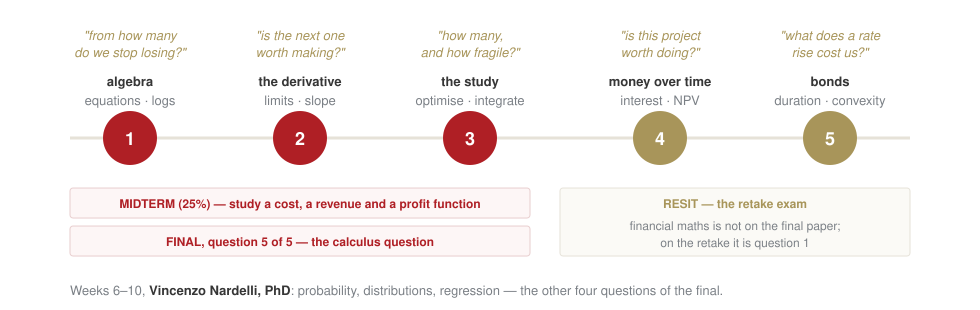
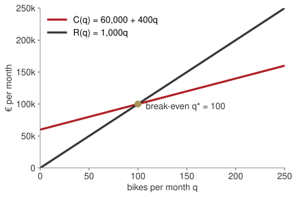
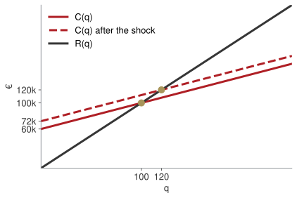
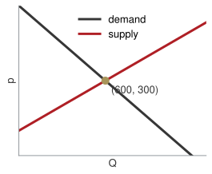
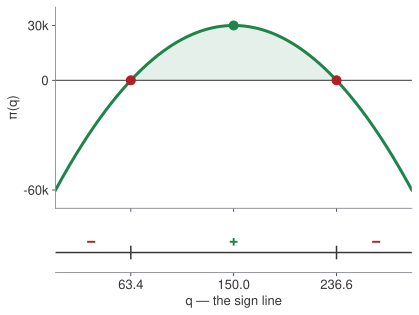

## Where the first five weeks go

:::: {.columns}
::: {.column width="58%"}
| Wk | Date | What you will be able to do by hand |
|---|---|---|
| 1 | 24 Sep | equations, systems, quadratics, logs |
| 2 | 1 Oct | read a function; limits; the derivative |
| 3 | 8 Oct | study a function; optimise; integrate |
| 4 | 15 Oct | interest, discounting, NPV |
| 5 | 22 Oct | bonds, duration, convexity; mock exam |
:::
::: {.column width="42%"}
**Two things count.**

Midterm (25%): a report to a Board built on the study of a cost, a revenue and a profit function. Due 1 Nov.

Final exam (75%): 3 hours, paper, calculator. One of five questions is pure calculus: integrals, limits, recovering a function from its derivative.
:::
::::

[Every technique in this room is here because one of those two asks for it. I will tell you which one, every time.]{.red}

## The map — come back to this every week

{fig-align="center" width="92%"}

[We will put a mark on this at the start of every session, so you always know where you are standing.]{.muted}

## The shape of an exam item

:::: {.columns}
::: {.column width="50%"}
**Same form as the final, different numbers:**

$$\int \frac{x^{5} - 3x^{3} + 2}{x^{2}}\,dx$$
$$\lim_{x \to 1^{+}} \frac{(x-1)^{2}}{x - x^{2}}$$
$$f'(x) = 6x^{2} - 2x,\quad f(1) = 4 \;\Rightarrow\; f(x) = ?$$
:::
::: {.column width="50%"}
Today we do none of this. Today we make sure that when we get there, the *algebra* underneath — dividing term by term, factoring, solving for an unknown, handling a log — is not what slows you down.

Everything today is a question the founder of a small firm actually has to answer.
:::
::::

## The case: Arno Bikes

| | |
|---|---|
| **e-bike assembler, Florence** | |
| Fixed cost | €60,000 per month (rent, salaries, insurance) |
| Variable cost | €400 per bike (parts, packaging) |
| List price | €1,000 per bike |

Four questions from the founder, one per block:

**A.** How many bikes before I stop losing money? · **B.** How many bikes should I make?
**C.** How long until revenue doubles? · **D.** Is this battery cell within spec?

## [Block A]{.section-kicker} Launch or not? — linear equations and systems {.section-slide background-color="#AF1F25"}

## How many bikes a month before Arno Bikes stops losing money?

::: {.callout-important title="Bet before we compute"}
Write a number. Do not compute yet.
:::

Two facts, written as two functions of the monthly quantity $q$:

$$C(q) = 60{,}000 + 400\,q \qquad\qquad R(q) = 1{,}000\,q$$

. . .

Break-even is where they meet: $R(q) = C(q)$.

## Two lines and a crossing

:::: {.columns}
::: {.column width="55%"}

:::
::: {.column width="45%"}
$$1{,}000\,q = 60{,}000 + 400\,q$$
$$600\,q = 60{,}000$$
$$q^{*} = \frac{60{,}000}{600} = 100$$

**Reading.** €600 is the *contribution* of each bike. Break-even is fixed cost ÷ contribution.
:::
::::

## Move the price. Then raise the rent. {.lab background-color="#2471A3"}

[LAB · session.ipynb § A]{.kicker}

1. Bet: what price makes break-even 50 bikes? Then slide.
2. The landlord raises fixed cost to €72,000. Before running: what happens to the cost line, and to the crossing?

Watch the *slope* and the *intercept* separately. Only one of them moved.

## A cost shock is a parallel shift — remember this for the midterm

:::: {.columns}
::: {.column width="55%"}

:::
::: {.column width="45%"}
Same slope (€400 per bike), higher intercept.

New break-even: $1{,}000q = 72{,}000 + 400q \Rightarrow q^{*} = 120$.

[The midterm asks how a tariff on an input changes the cost and profit *schedules*. That is this picture with different names: a per-unit tariff changes the slope, a lump-sum cost changes the intercept.]{.red}
:::
::::

## The whole market: two facts, two unknowns

Buyers in Tuscany $Q_d = 1200 - 2p$; sellers $Q_s = -300 + 3p$. [**Bet:** what price clears the market?]{.red}

:::: {.columns}
::: {.column width="30%"}
**Substitution**

$$\begin{aligned}
1200 - 2p &= -300 + 3p \\
1500 &= 5p \\
p^{*} &= 300,\; Q^{*} = 600
\end{aligned}$$
:::
::: {.column width="30%"}
**Elimination**

$$\begin{aligned}
Q + 2p &= 1200 \\
Q - 3p &= -300 \\
\text{subtract: } 5p &= 1500
\end{aligned}$$
:::
::: {.column width="40%"}
**Picture**

:::
::::

::: {.callout-tip title="Board sentence"}
One equation is one fact about the business. Two unknowns need two facts. Write the facts as equations before touching a number.
:::

## An equation answers "where". An inequality answers "from where on".

$$1{,}000q = 60{,}000 + 400q \;\Rightarrow\; q = 100 \qquad\qquad 1{,}000q \geq 60{,}000 + 400q \;\Rightarrow\; q \geq 100$$

The first is the break-even point. The second is **the condition for not losing money** — and it is the second one a Board asks for.

[One rule, and it is the only one that costs marks: multiplying or dividing an inequality by a **negative** number reverses it.]{.red}

## D1, D2, D3b (core) — D3 (stretch) {.paper background-color="#eceff0"}

[PAPER · drills.md]{.kicker}

10 minutes. Show all work, exam style. I come round.

## [Block B]{.section-kicker} How many bikes? — quadratics {.section-slide background-color="#AF1F25"}

## Price responds to volume

The founder learns: at €1,000 she sells 150 bikes; every €4 cut sells one more.

$$p(q) = 1600 - 4q$$

Revenue is **price × quantity**: a rectangle whose sides pull in opposite directions.

::: {.callout-important title="Bet before we compute"}
Does selling more *always* bring more revenue? Yes / no, and roughly where it stops.
:::

## The revenue rectangle sweeps out a parabola {.clip background-color="#000000"}

<video class="clipvideo" width="1000" height="562" controls muted loop playsinline data-autoplay preload="auto" poster="media/w01_parabola_poster.png"><source src="media/w01_parabola.mp4" type="video/mp4"></video>

Clip rendered with manim from `anim/src/week01_scenes.py`.

## Revenue, cost, profit

$$R(q) = (1600 - 4q)\,q = 1600q - 4q^{2}$$
$$\pi(q) = R(q) - C(q) = -4q^{2} + 1200q - 60{,}000$$

. . .

**Where is profit zero?** First move, always: divide out the common factor.

$$q^{2} - 300q + 15{,}000 = 0$$
$$q = \frac{300 \pm \sqrt{300^{2} - 4\cdot 15{,}000}}{2} = \frac{300 \pm \sqrt{30{,}000}}{2} \approx 63.4,\;\; 236.6$$

## The discriminant decides before you compute

:::: {.columns}
::: {.column width="48%"}
| $b^{2} - 4ac$ | roots | in business |
|---|---|---|
| $> 0$ | two | a profitable window |
| $= 0$ | one | a single break-even |
| $< 0$ | none | no viable scale |

**Where is profit positive?** A downward parabola ($a<0$) is positive *between* its roots:

$$63.4 < q < 236.6$$
:::
::: {.column width="52%"}

[The sign line. In the midterm it is called "the sign of the profit function".]{.muted style="font-size:.7em"}
:::
::::

## Push the fixed cost up. Where do the two break-evens merge? {.lab background-color="#2471A3"}

[LAB · session.ipynb § B]{.kicker}

1. Bet on the fixed cost at which the roots become one. (Hint: what is the profit at the vertex now?)
2. Then push further. What does "no roots" look like, and what does it mean for the founder?

## The top of the hill, for now

Vertex of $\pi(q) = -4q^{2} + 1200q - 60{,}000$:

$$q_{v} = -\frac{b}{2a} = -\frac{1200}{-8} = 150 \qquad \pi(150) = 30{,}000$$

This formula works for parabolas only.

[Next week you get a tool that finds the top of the hill for *any* curve — a log revenue, a cubic cost, anything. It is called the derivative, and it is the reason this course exists.]{.red}

::: {.callout-tip title="Board sentence"}
A quadratic has two roots, one, or none, and the discriminant tells you which before you compute. In business: a profitable window, a single break-even, no viable scale.
:::

## D4, D5 (core) — D6 (stretch: factor and cancel) {.paper background-color="#eceff0"}

[PAPER · drills.md]{.kicker}

10 minutes. Show all work, exam style. I come round.

## [Block C]{.section-kicker} How long to double? — exponentials and logarithms {.section-slide background-color="#AF1F25"}

## Revenue €1.2M, growing 12% a year

$$R(t) = 1.2 \cdot 1.12^{\,t}$$

Linear growth adds the same **amount** each year. Exponential growth adds the same **percentage**.

::: {.callout-important title="Bet before we compute"}
How many years to double? Write a number.
:::

## Linear versus exponential growth {.clip background-color="#000000"}

<video class="clipvideo" width="1000" height="562" controls muted loop playsinline data-autoplay preload="auto" poster="media/w01_growth_poster.png"><source src="media/w01_growth.mp4" type="video/mp4"></video>

Clip rendered with manim from `anim/src/week01_scenes.py`.

## The unknown is in the exponent

$$1.2 \cdot 1.12^{\,t} = 2.4 \quad\Longrightarrow\quad 1.12^{\,t} = 2$$

No algebra so far reaches $t$. **That is what a logarithm is for:** it answers "to what power?"

. . .

$$\ln\!\left(1.12^{\,t}\right) = \ln 2 \;\Longrightarrow\; t\,\ln 1.12 = \ln 2 \;\Longrightarrow\; t = \frac{0.6931}{0.1133} \approx 6.1 \text{ years}$$

. . .

| rule | reading |
|---|---|
| $\ln(ab) = \ln a + \ln b$ | growth factors multiply, their logs add |
| $\ln(a/b) = \ln a - \ln b$ | a ratio of revenues becomes a difference |
| $\ln a^{k} = k \ln a$ | $k$ years of the same growth: the exponent comes down |
| $\log_{b} x = \ln x / \ln b$ | any base through the calculator's $\ln$ |

## The sanity check you will use in the exam

$$t_{\text{double}} \approx \frac{70}{g_{\%}} \qquad\qquad \frac{70}{12} \approx 5.8$$

Why it works: $\ln 2 \approx 0.69$ and $\ln(1+g) \approx g$ when $g$ is small, so $t = \ln 2 / \ln(1+g) \approx 0.69/g$.

The number $e \approx 2.718$ appears today only as "the base your calculator's $\ln$ uses". In week 4 it becomes continuous compounding and earns its place.

::: {.callout-tip title="Board sentence"}
Whenever the unknown is in the exponent, take logs of both sides. Whenever you see a log, remember it is a question: to what power?
:::

## D7, D8 (core) — D9 (stretch: $5e^{0.03t} = 8$) {.paper background-color="#eceff0"}

[PAPER · drills.md]{.kicker}

12 minutes. Show all work, exam style. I come round.

## [Block D]{.section-kicker} Within tolerance — absolute value {.section-slide background-color="#AF1F25"}

## Is this cell within spec?

Battery cells must be $500\,\text{Wh} \pm 15$. A supplier ships one at 483 Wh.

::: {.callout-important title="Bet before we compute"}
In or out? Then write the rule as one inequality.
:::

. . .

$$|c - 500| \le 15 \;\Longleftrightarrow\; 485 \le c \le 515 \;\Longleftrightarrow\; c \in [485,\,515]$$

{width="70%" fig-align="center"}

[$|x-a|$ is the **distance** from $a$. "$\le b$" is the closed interval $[a-b,\,a+b]$; "$> b$" is the two tails $x<a-b$ or $x>a+b$. Square bracket: endpoint included. Round bracket: excluded, or $\pm\infty$. The exam asks for domains written exactly like this.]{style="font-size:.75em"}

## D10, D11 (core) — interval notation {.paper background-color="#eceff0"}

[PAPER · drills.md]{.kicker}

8 minutes. Show all work, exam style. I come round.

## [Close]{.section-kicker} Board pitch and take home {.section-slide background-color="#AF1F25"}

## Sixty seconds to the Board

One of you stands up. The other is the Board.

Tell them, with numbers and no formulas:

- where Arno Bikes breaks even at today's price;
- between which volumes it makes money once price responds to volume, and how fragile that window is;
- how long until revenue doubles at 12%.

The Board asks one question. [This is a rehearsal of the midterm's oral.]{.muted}

## Take home

1. Write the facts as equations before touching numbers.
2. Discriminant first, then roots, then the sign line.
3. Unknown in the exponent → take logs of both sides.

**Homework 1** (`homework.md`), due Wednesday 30 September 23:59 on Moodle: eight drills on paper + a 150–250-word memo to the Board on the profitable window.

Write your own three take-home lines now, before you leave.
