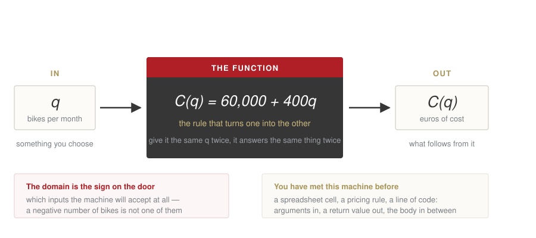
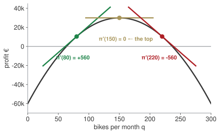

## Homework 1, at the board {.paper background-color="#eceff0"}

[PAPER · 15 minutes]{.kicker}

One of you takes us through it. Pick one drill you got stuck on. We want the working, the wrong turn included.

[Not an exam: the point is to see how you got there.]{.muted}

## Last week, in one minute

::: {.blocks}
::: {.blk .recap}
[Block A]{.blk-letter}How many bikes before we stop losing money?[100 — fixed cost ÷ contribution: 60,000 / 600]{.blk-answer}
:::
::: {.blk .recap}
[Block B]{.blk-letter}How many bikes should we make?[150, for €30,000 — vertex −b/2a; profitable between 63 and 237]{.blk-answer}
:::
::: {.blk .recap}
[Block C]{.blk-letter}How long until revenue doubles?[6.1 years — unknown in the exponent: $t = \ln 2 / \ln 1.12$]{.blk-answer}
:::
::: {.blk .recap}
[Block D]{.blk-letter}Is this battery cell within spec?[No — $|c - 500| \le 15$ means $[485, 515]$; 483 is out]{.blk-answer}
:::
:::

[The vertex formula only works for parabolas. Today: the tool that works for any curve.]{.red}

## Where we are

:::: {.columns}
::: {.column width="56%"}
| Wk | Date | What you can do by hand |
|---|---|---|
| 1 | 24 Sep | equations, quadratics, logs ✓ |
| **2** | **1 Oct** | **read a function; limits; the derivative** |
| 3 | 8 Oct | study a function; optimise; integrate |
| 4 | 15 Oct | interest, discounting, NPV |
| 5 | 22 Oct | bonds, duration, convexity |
:::
::: {.column width="44%"}
**Today serves both assessments.**

The **midterm** asks you to study a cost, a revenue and a profit function. Everything in that study is built on the derivative.

Three of the five items in the final's calculus question are here: a limit that factors, a derivative term by term, and a function recovered from its derivative.
:::
::::

[Last week you found the top of a hill with a formula that only works for parabolas. Today you get the one that works for any curve.]{.red}

## First, the midterm {.lab background-color="#2471a3"}

[BRIEFING · 35 minutes]{.kicker}

Before any mathematics: what the midterm asks, how it is marked, and what a good one looks like.

1. The brief, read together, line by line.
2. The seven things a "full study of a function" must contain — in the brief's own words: domain, **limits**, **range**, sign, maxima and minima, convexity and inflection, sketch.
3. What the qualitative sections want, and what referencing means here.
4. The timetable back from 1 November.

Questions now, not in the last week of October.

## Four blocks today {.hub auto-animate=true}

::: {.blocks}
::: {.blk .now data-id="blkA"}
[Block A]{.blk-letter}What a function is, once you have to use one[domain · the four shapes]{.blk-tool}
:::
::: {.blk .next}
[Block B]{.blk-letter}What happens near a point you cannot reach[limits]{.blk-tool}
:::
::: {.blk .next}
[Block C]{.blk-letter}What does one more bike do to profit?[the derivative]{.blk-tool}
:::
::: {.blk .next}
[Block D]{.blk-letter}From the marginal back to the total[running it backwards]{.blk-tool}
:::
:::

## [Block A]{.section-kicker} What a function is, once you have to use one {.section-slide background-color="#AF1F25" auto-animate=true}

::: {.blk-fill data-id="blkA"}
:::

## A function is a machine

{fig-align="center" width="92%"}

You put something in, something comes out, and **what happens inside is the function**. Nothing else about it matters.

[Keep this picture. It is the same picture as a cell in a spreadsheet, a pricing rule, and a line of code — arguments in, a value out, a body in between. We will use it all term.]{.red}

## Four functions, one firm

:::: {.columns}
::: {.column width="52%"}
| | |
|---|---|
| straight line | `C(q) = 60,000 + 400q` |
| parabola | `π(q) = −4q² + 1200q − 60,000` |
| exponential | `R(t) = 1.2 · 1.12ᵗ` |
| logarithm | `R(q) = 30 ln(q + 1)` |

Each one is a sentence about a business, written so it can be computed.
:::
::: {.column width="48%"}
**Domain** is the first question, always: for which `q` does this mean anything?

$$\begin{aligned}
\sqrt{q-20} \;&\text{ needs } q \geq 20 \\[2pt]
\ln(q-5) \;&\text{ needs } q > 5 \\[2pt]
\tfrac{120}{q-40} \;&\text{ breaks at } q = 40
\end{aligned}$$

[The exam asks "state the domain" and expects an interval, with the bracket chosen on purpose.]{.muted}
:::
::::

::: {.callout-important title="Bet before we compute"}
`π(100)` and `π(200)`. One is bigger. Which, and by how much?
:::

## Nothing here is memorised. Each rule is a question with no answer.

Ask what the symbol is *asking for*, and the restriction falls out on its own.

| the symbol | the question it asks | when there is no answer |
|---|---|---|
| $\sqrt{x}$ | *what number, times itself, gives `x`?* | `x < 0` — a square is never negative |
| $\ln x$ | *to what power must `e` be raised to give `x`?* | `x ≤ 0` — a positive base never reaches zero |
| $\dfrac{a}{x}$ | *how many `x` fit into `a`?* | `x = 0` — nothing fits into nothing |

. . .

So $\sqrt{q-20}$ needs **the thing inside**, not `q`, to be at least zero: `q − 20 ≥ 0`.

[Three rules, or one habit: put the bracket's contents where the rule's own question can be asked. You will never have to remember which is `≥` and which is `>` — `√0 = 0` is fine, `ln 0` is not.]{.red}

## D1, D2 — domains, and the four functions {.paper background-color="#eceff0"}

[PAPER · drills.md]{.kicker}

10 minutes. Show all work, exam style. I come round.

## Four blocks today {.hub auto-animate=true}

::: {.blocks}
::: {.blk .done}
[Block A]{.blk-letter}What a function is, once you have to use one[domain · the four shapes]{.blk-tool}
:::
::: {.blk .now data-id="blkB"}
[Block B]{.blk-letter}What happens near a point you cannot reach[limits]{.blk-tool}
:::
::: {.blk .next}
[Block C]{.blk-letter}What does one more bike do to profit?[the derivative]{.blk-tool}
:::
::: {.blk .next}
[Block D]{.blk-letter}From the marginal back to the total[running it backwards]{.blk-tool}
:::
:::

## [Block B]{.section-kicker} Limits — what happens near a point you cannot reach {.section-slide background-color="#AF1F25" auto-animate=true}

::: {.blk-fill data-id="blkB"}
:::

## What does one bike cost? It depends how many you make.

The rent is €60,000 whether you build one bike or a thousand. **Split it between the bikes:**

$$AC(q) = \frac{60{,}000 + 400q}{q} \;=\; \underbrace{\frac{60{,}000}{q}}_{\text{the rent, shared}} + \underbrace{400}_{\text{the parts, per bike}}$$

::: {.callout-important title="Bet before we compute"}
At 30 bikes a month, what does one bike cost the firm? At 300?
:::

## The rent, split thinner and thinner {.clip background-color="#000000"}

<video class="clipvideo" width="1000" height="562" controls muted loop playsinline data-autoplay preload="auto" poster="media/w02_avgcost_poster.png"><source src="media/w02_avgcost.mp4" type="video/mp4"></video>

The gold bar is the rent per bike. It shrinks; the €400 floor never moves.

## Which is two limits, and a floor

$$\lim_{q \to 0^{+}} AC(q) = +\infty \qquad\qquad \lim_{q \to \infty} AC(q) = 400$$

**At `q = 0` the expression means nothing** — you cannot divide by nothing — but you can ask what happens *near* zero, and the answer is: ruinous. One bike carries the whole rent.

Far out, the shared rent vanishes and average cost settles onto the variable cost. It never goes below €400, because every bike really does need €400 of parts.

[**Economies of scale, in two limits.** And a limit is exactly this: not the value *at* a point, but the value the function heads towards as you approach it.]{.red}

## The one that looks impossible

$$\lim_{q \to 10} \frac{q^{2} - 100}{q - 10}$$

Substitute and you get `0/0`, which says nothing. So do not substitute first.

. . .

$$\frac{(q-10)(q+10)}{q-10} = q + 10 \;\longrightarrow\; 20$$

::: {.callout-tip title="Board sentence"}
`0/0` is not an answer, it is an instruction: factor, cancel, then substitute.
:::

## D4, D5, D6 — limits, including one from the exam {.paper background-color="#eceff0"}

[PAPER · drills.md]{.kicker}

12 minutes. D5 is a one-sided limit in exactly the form the final exam uses.

## Four blocks today {.hub auto-animate=true}

::: {.blocks}
::: {.blk .done}
[Block A]{.blk-letter}What a function is, once you have to use one[domain · the four shapes]{.blk-tool}
:::
::: {.blk .done}
[Block B]{.blk-letter}What happens near a point you cannot reach[limits]{.blk-tool}
:::
::: {.blk .now data-id="blkC"}
[Block C]{.blk-letter}What does one more bike do to profit?[the derivative]{.blk-tool}
:::
::: {.blk .next}
[Block D]{.blk-letter}From the marginal back to the total[running it backwards]{.blk-tool}
:::
:::

## [Block C]{.section-kicker} The derivative {.section-slide background-color="#AF1F25" auto-animate=true}

::: {.blk-fill data-id="blkC"}
:::

## How much does one more bike change profit?

At 80 bikes a month, what does the eighty-first bike add?

::: {.callout-important title="Bet before we compute"}
More than €1,000, between €0 and €1,000, or negative? Commit to one.
:::

The honest way to ask it: take two quantities, measure the change in profit, divide by the change in quantity. Then let the two quantities come together.

## Two points become one {.clip background-color="#000000"}

<video class="clipvideo" width="1000" height="562" controls muted loop playsinline data-autoplay preload="auto" poster="media/w02_secant_poster.png"><source src="media/w02_secant.mp4" type="video/mp4"></video>

The slope over an interval becomes the slope at a point.

## The definition, once

$$\pi'(a) \;=\; \lim_{h \to 0} \frac{\pi(a+h) - \pi(a)}{h}$$

You will use this definition roughly twice in your life. What you will use every day is what it produces:

| | |
|---|---|
| `qⁿ` | `n qⁿ⁻¹` |
| a constant | `0` |
| `ln q` | `1/q` |
| `e^(kq)` | `k e^(kq)` |
| sums | differentiate term by term |

## Differentiating, as a procedure you can follow

Never ask "what is the derivative of this?" Ask the questions in order.

| ask | then |
|---|---|
| **1.** Is it a **sum**? | split it; do each piece alone |
| **2.** A **number**, no `q`? | it becomes `0` |
| **3.** A **power** `a·qⁿ`? | `n` comes down in front, the power drops by one |
| **4.** A **log** `a·ln(q)`? | it becomes `a/q` |

$$-4q^{2} \to -8q \qquad 1200q \to 1200 \qquad -60{,}000 \to 0 \qquad 30\ln q \to \tfrac{30}{q}$$

. . .

$$\pi(q) = \underbrace{-4q^{2}}_{3} + \underbrace{1200q}_{3} \underbrace{- \,60{,}000}_{2} \;\longrightarrow\; \pi'(q) = -8q + 1200$$

[A lone `q` is `q¹`, so rule 3 leaves just the number in front of it.]{.muted}

## Question 5: is there something *inside* something?

`ln(q + 1)` is not `ln q`. There is a second function hiding inside the first, and the midterm's revenue function is exactly this shape.

$$\frac{d}{dq}\,f\big(g(q)\big) \;=\; f'\big(g(q)\big) \cdot g'(q)$$

**Differentiate the outside, leave the inside alone, then multiply by the derivative of the inside.**

. . .

:::: {.columns}
::: {.column width="50%"}
$$\ln(q+1) \;\to\; \frac{1}{q+1}\cdot \underbrace{1}_{\text{inside}'} = \frac{1}{q+1}$$
$$\ln(3q) \;\to\; \frac{1}{3q}\cdot 3 = \frac{1}{q}$$
:::
::: {.column width="50%"}
$$(2q+5)^{4} \;\to\; 4(2q+5)^{3}\cdot 2 = 8(2q+5)^{3}$$
$$e^{0.12t} \;\to\; e^{0.12t}\cdot 0.12$$
:::
::::

[Why `ln(q+1)` looked free: the inside is `q + 1`, whose derivative is 1, so the multiplication does nothing and you never saw it. Change the inside to `3q` and it shows up.]{.red}

## The chain rule is the reason a few things work

| you will meet it in | as |
|---|---|
| the midterm | `R(q) = 20 ln(q + 1)`, differentiated to find the optimum |
| week 4 | continuous compounding: `e^(it)` differentiates to `i·e^(it)` |
| week 5 | duration: the bond price is `(1+y)^(−t)`, and the `−t` comes down |
| week 3, backwards | `∫ f'/f = ln\|f\|` is this rule read in reverse |

::: {.callout-tip title="Board sentence"}
Outside first, inside untouched, then multiply by the inside's derivative. If the inside is just `q`, the multiplication is by 1 and you never notice.
:::

## Read it off the curve

{fig-align="center" width="78%"}

Same curve, three places, three answers to the same question: **is the next bike worth making?**

## The tangent walks the curve {.clip background-color="#000000"}

<video class="clipvideo" width="1000" height="562" controls muted loop playsinline data-autoplay preload="auto" poster="media/w02_tangent_poster.png"><source src="media/w02_tangent.mp4" type="video/mp4"></video>

Positive, then flat, then negative. The flat point is the top.

## Move the price, watch the slope {.lab background-color="#2471a3"}

[LAB · session.ipynb § C]{.kicker}

1. Bet: if the price cut per extra bike were €3 instead of €4, would the best quantity rise or fall?
2. Then slide it, and watch where `π'(q) = 0` moves to.

The slider changes one number. The whole answer moves with it.

## Last week's formula, and this week's

:::: {.columns}
::: {.column width="50%"}
**Week 1, only for parabolas:**
$$q_v = -\frac{b}{2a} = -\frac{1200}{-8} = 150$$
:::
::: {.column width="50%"}
**Today, for anything:**
$$\pi'(q) = -8q + 1200 = 0 \;\Rightarrow\; q = 150$$
:::
::::

Same answer. But the second one still works when revenue is `30 ln(q+1)`, or cost is cubic, or the curve has no formula you recognise.

::: {.callout-tip title="Board sentence"}
The derivative answers one managerial question: what does one more unit do? Positive means make more, negative means make fewer, zero means stop.
:::

## D8, D9 — differentiate, then read the answer {.paper background-color="#eceff0"}

[PAPER · drills.md]{.kicker}

12 minutes. In D9 write the sentence a manager would say, not just the number.

## Four blocks today {.hub auto-animate=true}

::: {.blocks}
::: {.blk .done}
[Block A]{.blk-letter}What a function is, once you have to use one[domain · the four shapes]{.blk-tool}
:::
::: {.blk .done}
[Block B]{.blk-letter}What happens near a point you cannot reach[limits]{.blk-tool}
:::
::: {.blk .done}
[Block C]{.blk-letter}What does one more bike do to profit?[the derivative]{.blk-tool}
:::
::: {.blk .now data-id="blkD"}
[Block D]{.blk-letter}From the marginal back to the total[running it backwards]{.blk-tool}
:::
:::

## [Block D]{.section-kicker} Running it backwards {.section-slide background-color="#AF1F25" auto-animate=true}

::: {.blk-fill data-id="blkD"}
:::

## From the derivative back to the function

The exam asks this in one direction and the other. Given `f'`, find `f`.

$$f'(q) = 6q^{2} - 2q \quad\Longrightarrow\quad f(q) = 2q^{3} - q^{2} + c$$

. . .

The `c` is not decoration. Every function `2q³ − q² + c` has the same derivative, so one extra fact pins it down:

$$f(1) = 4 \;\Rightarrow\; 2 - 1 + c = 4 \;\Rightarrow\; c = 3$$

## And it means something

Given marginal cost `MC(q) = 0.8q + 3`, the cost function is

$$C(q) = 0.4q^{2} + 3q + c$$

and `c = C(0)` is the **fixed cost** — what you pay having produced nothing.

[The constant of integration is not a technicality here. It is the rent.]{.red}

## D11, D12 — recover the function {.paper background-color="#eceff0"}

[PAPER · drills.md]{.kicker}

8 minutes. Exam form: every answer ends with the constant found, not left as `c`.

## [Close]{.section-kicker} Take home {.section-slide background-color="#AF1F25"}

## Take home

1. Domain first, always. The exam gives marks for the interval.
2. `0/0` means factor, cancel, then substitute.
3. The derivative is the answer to "what does one more do?"
4. Reversing it needs a constant, and one fact to pin it down.

**Homework 2** (`homework.md`), due Wednesday 7 October 23:59 on Moodle: eight drills plus a memo to the Board on whether to build the next bike.

Write your own three take-home lines now, before you leave.
