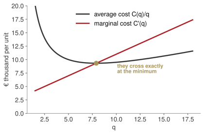
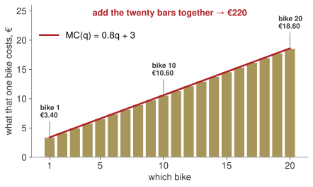

## Where we are

:::: {.columns}
::: {.column width="56%"}
| Wk | Date | What you can do by hand |
|---|---|---|
| 1 | 24 Sep | equations, quadratics, logs ✓ |
| 2 | 1 Oct | functions, limits, the derivative ✓ |
| **3** | **8 Oct** | **study a function; optimise; integrate** |
| 4 | 15 Oct | interest, discounting, NPV |
| 5 | 22 Oct | bonds, duration, convexity |
:::
::: {.column width="44%"}
**Today is the midterm.**

Not a rehearsal of part of it: the whole mathematical content of the midterm is the seven-step study you will do this morning, applied to a cost, a revenue and a profit function.

The last block, integration, is the remaining two items of the final's calculus question.
:::
::::

[There is a quiz in this session. It is short, it is not secret, and it covers weeks 1–3.]{.red}

## The seven steps, in the brief's own words

| | |
|---|---|
| 1 | **domain** — for which `q` does this mean anything? An interval. |
| 2 | **limits** — at the ends of the domain, and at any break: the asymptotes |
| 3 | **range** — what values the function actually takes |
| 4 | **sign** — where positive, where negative; the zeros are how you find out |
| 5 | **maxima and minima** — solve `f'(q) = 0`, then the **sign of `f''`** names each one |
| 6 | **convexity and inflection** — where `f''` changes sign |
| 7 | **sketch** — last, with every point above marked on it |

[These are the brief's own seven words, in the brief's own order. Answer in its vocabulary and the marker cannot miss what you have done.]{.red}

## Seven steps, watched once {.clip background-color="#000000"}

<video class="clipvideo" width="1000" height="562" controls muted loop playsinline data-autoplay preload="auto" poster="media/w03_study_poster.png"><source src="media/w03_study.mp4" type="video/mp4"></video>

The same profit function you already know, taken apart in the exam's order.

## [Block A]{.section-kicker} The study, done properly {.section-slide background-color="#AF1F25"}

## Step by step on a function you know

$$\pi(q) = -4q^{2} + 1200q - 60{,}000$$

:::: {.columns}
::: {.column width="50%"}
1. **Domain** `[0, +∞)` for a quantity.
2. **Limits** `π(0) = −60,000`; `π(q) → −∞` as `q → ∞`. No asymptote: a polynomial has none.
3. **Range** `(−∞, 30,000]` — it reaches its maximum and never exceeds it.
4. **Sign** zeros at `63.4` and `236.6`; positive between them.
:::
::: {.column width="50%"}
5. **Max / min** `π'(q) = −8q + 1200 = 0` → `q = 150`; `π''= −8 < 0`, so a **maximum**, `π(150) = 30,000`.
6. **Convexity** `π''< 0` everywhere: concave throughout, no inflection.
7. **Sketch** with all of the above marked.
:::
::::

::: {.callout-tip title="Board sentence"}
`f'` finds the candidates; `f''` says which kind each one is. Writing "maximum" without the second derivative earns nothing.
:::

## Limits at the edge: where the curve runs off the page

Step 2 asks for limits, and limits are how you find **asymptotes** — the lines the curve approaches and never meets. The resit asks for them by name.

:::: {.columns}
::: {.column width="50%"}
**Vertical.** Look at the edge of the domain.
`f(q) = 7 ln(q + 3)` is defined for `q > −3`, and

$$\lim_{q \to -3^{+}} 7\ln(q+3) = -\infty$$

so the line `q = −3` is a vertical asymptote.
:::
::: {.column width="50%"}
**Horizontal.** Look at infinity.
`AC(q) = 0.4q + 3 + 25/q` has none: it grows without bound.
But `(60,000 + 400q)/q → 400`, so `y = 400` **is** one.
:::
::::

[A sketch with no asymptote drawn, where one exists, is marked as an incomplete sketch.]{.red}

## The second derivative, in one line

$$f'' > 0 \;\Rightarrow\; \text{convex, holds water, a minimum}$$
$$f'' < 0 \;\Rightarrow\; \text{concave, spills water, a maximum}$$

An **inflection** is where `f''` changes sign: the curve stops bending one way and starts bending the other. In business that is where growth stops accelerating and begins to slow — the moment worth naming in a report.

## D1 — the full study, in exam format {.paper background-color="#eceff0"}

[PAPER · drills.md]{.kicker}

15 minutes. This is the midterm's Q2 with different numbers. Write all seven steps, labelled.

## [Block B]{.section-kicker} Optimisation, and what it is for {.section-slide background-color="#AF1F25"}

## Where average cost is lowest

{fig-align="center" width="72%"}

::: {.callout-important title="Bet before we compute"}
Marginal cost crosses average cost. Is the crossing to the left of the minimum, at it, or to the right?
:::

## It is at the minimum, and that is not a coincidence

`C(q) = 0.4q² + 3q + 25`, so `AC(q) = 0.4q + 3 + 25/q`.

$$AC'(q) = 0.4 - \frac{25}{q^{2}} = 0 \;\Rightarrow\; q^{2} = 62.5 \;\Rightarrow\; q \approx 7.91$$

. . .

There `AC = 9.32` and `C'(7.91) = 9.32`. **Equal.**

While the next unit costs less than the average, it pulls the average down. When it costs more, it pushes it up. The average stops falling exactly when the two meet.

## The rule that runs every firm

$$\pi'(q) = 0 \quad\Longleftrightarrow\quad R'(q) = C'(q)$$

**Produce up to the point where the revenue from one more unit equals what that unit costs.**

. . .

For `R(q) = 30 ln(q+1)` and `C(q) = 0.4q² + 3q + 25`:

$$\frac{30}{q+1} = 0.8q + 3 \;\Rightarrow\; 4q^{2} + 19q - 135 = 0 \;\Rightarrow\; q \approx 3.90$$

## Push the log revenue {.lab background-color="#2471a3"}

[LAB · session.ipynb § B]{.kicker}

1. Bet: raise the coefficient on the log revenue from 30 to 40. Does the optimum move a lot, or a little?
2. Then raise the fixed cost from 25 to 60. Does the optimum move at all?

The second one has a lesson in it. Watch what changes and what does not.

## D4, D5 — optimise, and read the condition {.paper background-color="#eceff0"}

[PAPER · drills.md]{.kicker}

12 minutes. In D5 say what the firm should do, in a sentence, before you compute anything.

## [Block C]{.section-kicker} Integration — adding up the marginal {.section-slide background-color="#AF1F25"}

## Every bike has its own price tag

Marginal cost is not "the cost". It is **the cost of the next one**, and it is different for every one.

| | | |
|---|---|---|
| the 1st bike | `MC ≈ 3.40` | the line is easy, nothing is strained |
| the 10th bike | `MC ≈ 10.60` | overtime starts, parts cost more |
| the 20th bike | `MC ≈ 18.60` | the plant is pushed |

::: {.callout-important title="Bet before we compute"}
So what do the **first twenty together** cost? Write a number.
:::

## Add up the price tags

{fig-align="center" width="82%"}

Twenty bikes, twenty price tags, twenty bars. **Pile them up and you have the total cost.**

. . .

The bars sum to exactly **€220**. Nothing has been approximated: each bar is one bike, and we added up all twenty.

## And now make the bikes smaller than bikes

A bike is a lump. But suppose you could make half a bike, then a tenth, then a thousandth.

The bars get thinner, there are more of them, and the pile becomes **the area under the line**.

. . .

That area has a name and a symbol, and the symbol is a stretched S for *sum*:

$$\int_{0}^{20} MC(q)\,dq$$

[Integration is not a new idea. It is adding up price tags, with the tags made infinitely thin.]{.red}

## Watch the slices thin {.clip background-color="#000000"}

<video class="clipvideo" width="1000" height="562" controls muted loop playsinline data-autoplay preload="auto" poster="media/w03_riemann_poster.png"><source src="media/w03_riemann.mp4" type="video/mp4"></video>

180, then 200, then 212, then 217 — climbing to 220.

## Three rules, and you can do every exam integral

:::: {.columns}
::: {.column width="47%"}
$$\int q^{n}\,dq = \frac{q^{n+1}}{n+1} + c \quad (n \neq -1)$$
$$\int \frac{1}{q}\,dq = \ln|q| + c$$
$$\int \frac{f'(q)}{f(q)}\,dq = \ln|f(q)| + c$$
:::
::: {.column width="53%"}
The exam's integral always arrives as a fraction. **Divide term by term first:**

$$\frac{q^{5} - 3q^{3} + 2}{q^{2}} = q^{3} - 3q + 2q^{-2}$$

Now each term is a power, or a log.
:::
::::

[The third rule is the one people arrive without, and the exam uses it.]{.red}

## The third rule, because the exam asks for it

A log appears whenever the top is the derivative of the bottom — exactly, or up to a constant you can factor out.

:::: {.columns}
::: {.column width="50%"}
$$\int \frac{1}{q-1}\,dq = \ln|q-1| + c$$

The bottom differentiates to 1. A shifted log, nothing more.
:::
::: {.column width="50%"}
$$\int \frac{q}{q^{2}-1}\,dq = \tfrac{1}{2}\ln|q^{2}-1| + c$$

The bottom differentiates to `2q`; the top is `q`, so put the missing `½` out front.
:::
::::

. . .

**Before integrating any fraction, ask one question: is the top the derivative of the bottom?** If yes, it is a log. If no, divide term by term and use the power rule.

## The definite integral, and what it measures

$$\int_{0}^{20} (0.8q + 3)\,dq = \Big[0.4q^{2} + 3q\Big]_{0}^{20} = 220$$

. . .

And the one worth remembering:

$$\int_{100}^{150} \pi'(q)\,dq = \pi(150) - \pi(100) = €10{,}000$$

[The integral of the marginal is the change in the total. That sentence is the whole of integration.]{.red}

::: {.callout-tip title="Board sentence"}
Differentiate to ask what one more does. Integrate to ask what all of them did.
:::

## D7, D8, D9 — the exam's integrals {.paper background-color="#eceff0"}

[PAPER · drills.md]{.kicker}

15 minutes. D7 and D8 are two of the five items of the final's calculus question, verbatim in form.

## Quiz {.lab background-color="#2471a3"}

[20 minutes · weeks 1–3 · not secret, not a trap]{.kicker}

Five short items: one domain, one limit, one derivative with its managerial reading, one stationary point with its nature, one integral.

Marked and returned next week. It counts for nothing and tells us both a great deal.

## [Close]{.section-kicker} Board pitch and take home {.section-slide background-color="#AF1F25"}

## Sixty seconds to the Board

Take the firm with `R(q) = 30 ln(q+1)` and `C(q) = 0.4q² + 3q + 25`.

Tell the Board, with numbers and no formulas:

- how much it should produce;
- how much it makes there;
- and how much room for error that leaves.

[That last question is the one the midterm actually rewards.]{.muted}

## Take home

1. Seven steps, in order. `f'` finds the point, `f''` names it.
2. Marginal equals average at the bottom of the average.
3. Produce until marginal revenue equals marginal cost.
4. Divide term by term before integrating; the integral of the marginal is the change in the total.

**Homework 3** (`homework.md`), due Wednesday 14 October 23:59: seven drills plus a **400–500 word Board report** — a dry run of the midterm, with a hand-drawn sketch.

Write your own three take-home lines now, before you leave.
