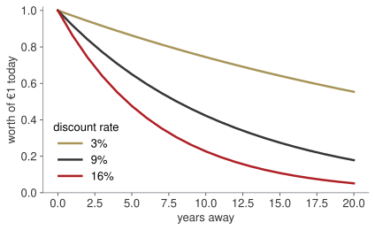

## Where we are

:::: {.columns}
::: {.column width="56%"}
| Wk | Date | What you can do by hand |
|---|---|---|
| 1–2 | 24 Sep – 1 Oct | algebra, limits, the derivative ✓ |
| 3 | 8 Oct | study, optimise, integrate ✓ |
| **4** | **15 Oct** | **interest, discounting, EAR, NPV** |
| 5 | 22 Oct | bonds, duration, convexity |
:::
::: {.column width="44%"}
**A change of subject, not of method.**

The calculus is behind you; from here the mathematics is arithmetic done carefully. What is new is that **every euro now carries a date**, and two euros with different dates cannot be added.

The resit's multiple-choice block is entirely this and next week.
:::
::::

## The case for two weeks

::: {.callout-note title="Arno Bikes, a decision"}
A new assembly line costs **€2.4M today** and is expected to return **€700k, €800k, €900k and €1,000k** at the end of each of the next four years. The firm borrows at **9%**.
:::

::: {.callout-important title="Bet before we compute"}
It returns €3.4M on a €2.4M outlay. Is that a million of profit? Yes or no — commit before the arithmetic.
:::

## [Block A]{.section-kicker} Interest, and what compounding actually does {.section-slide background-color="#AF1F25"}

## Two ways to be paid for waiting

:::: {.columns}
::: {.column width="50%"}
**Simple** — interest on the original sum only:
$$A = P(1 + it)$$
€8,000 at 6% for 3 years → **€9,440**
:::
::: {.column width="50%"}
**Compound** — interest on interest too:
$$A = P(1+i)^{t}$$
€8,000 at 6% for 3 years → **€9,528.13**
:::
::::

. . .

€88.13 of difference over three years. Over thirty it is not €88.

[Nobody in finance means "simple" when they say interest. It is in the syllabus so that you can name what compounding adds.]{.muted}

## More often is more

$$A = P\left(1 + \frac{i}{m}\right)^{mt}$$

`m` is how many times a year interest is added. €5,000 at 8% nominal for 4 years, quarterly: `5000(1.02)¹⁶ = €6,863.93`.

::: {.callout-important title="Bet before we compute"}
Compound 12% a year every single day instead of once. How much more than €1,120 does €1,000 become?
:::

## The ceiling, and where *e* comes from {.clip background-color="#000000"}

<video class="clipvideo" width="1000" height="562" controls preload="metadata" poster="media/w04_compounding_poster.png"><source src="media/w04_compounding.mp4" type="video/mp4"></video>

1,120 · 1,123.60 · 1,125.51 · 1,126.83 · 1,127.34 → **1,127.50**.

## Continuous compounding

$$\lim_{m \to \infty}\left(1 + \frac{i}{m}\right)^{m} = e^{\,i} \qquad\Longrightarrow\qquad A = P e^{\,it}$$

In week 1 `e` was "the base your calculator's `ln` uses". Here it earns its place: it is the ceiling on compounding, and the gap between weekly and continuous is sixteen cents on a thousand euros.

::: {.callout-tip title="Board sentence"}
Compounding more often always helps, and always by less. The limit is `e`.
:::

## [Block B]{.section-kicker} The effective rate — the only honest comparison {.section-slide background-color="#AF1F25"}

## Two quotes, same nominal rate, different price

$$EAR = \left(1 + \frac{i}{m}\right)^{m} - 1$$

| 12% nominal, compounded | EAR |
|---|---|
| semi-annually | 12.36% |
| quarterly | 12.55% |
| monthly | 12.68% |
| continuously | 12.75% |

[A nominal rate is not a price until you know `m`. This is the single most useful line of the whole module.]{.red}

## The trap, in one comparison

Bank A: **7.8% compounded monthly**.  Bank B: **8% compounded annually**.

::: {.callout-important title="Bet before we compute"}
Which do you borrow from?
:::

. . .

A: `(1 + 0.078/12)¹² − 1 = 8.085%`.  B: `8.000%`.

**Borrow from B.** The lower headline rate is the dearer loan.

## D4, D5 — put everything on the same basis {.paper background-color="#eceff0"}

[PAPER · drills.md]{.kicker}

12 minutes. Every answer states `m` explicitly before the arithmetic.

## [Block C]{.section-kicker} Discounting — running the clock backwards {.section-slide background-color="#AF1F25"}

## What is €10,000 in five years worth now?

$$PV = \frac{FV}{(1+r)^{t}} = \frac{10{,}000}{(1.07)^{5}} = €7{,}129.86$$

Compounding pushes money forward; discounting pulls it back. Same formula, read the other way.

{fig-align="center" width="62%"}

## Why the rate matters more than the forecast

At 3%, a euro in twenty years is worth 55 cents. At 16%, five cents.

[Two analysts can agree on every cash flow and disagree entirely on the answer, because they disagreed about one number at the front.]{.red}

## Two shortcuts you will use constantly

:::: {.columns}
::: {.column width="50%"}
**Annuity** — the same amount, `n` times:
$$PV = C\,\frac{1 - (1+r)^{-n}}{r}$$
€12,000 a year for 10 years at 6% → **€88,321**
:::
::: {.column width="50%"}
**Perpetuity** — the same amount, for ever:
$$PV = \frac{C}{r}$$
€12,000 a year for ever at 6% → **€200,000**
:::
::::

. . .

For ever is worth only 2.3 times ten years. Everything after year ten adds €111,679, because discounting shrinks distant money towards nothing.

## D8, D9 — present value, annuity, perpetuity {.paper background-color="#eceff0"}

[PAPER · drills.md]{.kicker}

12 minutes. Show the discount factor separately from the flow, every time.

## [Block D]{.section-kicker} NPV — the decision itself {.section-slide background-color="#AF1F25"}

## Back to the assembly line

$$NPV = -2{,}400 + \frac{700}{1.09} + \frac{800}{1.09^{2}} + \frac{900}{1.09^{3}} + \frac{1{,}000}{1.09^{4}}$$

| Year | Flow (€k) | Factor | PV (€k) |
|---|---|---|---|
| 0 | −2,400 | 1.000000 | −2,400.00 |
| 1 | 700 | 0.917431 | 642.20 |
| 2 | 800 | 0.841680 | 673.34 |
| 3 | 900 | 0.772183 | 694.97 |
| 4 | 1,000 | 0.708425 | 708.43 |
| | | **NPV** | **+318.94** |

## So the bet was wrong

The Board member said "€3.4M back on €2.4M out, a million of profit".

. . .

Adding flows from different years is the one thing this subject forbids. Discounted, the million is **€319,000** — still positive, still worth doing, but a third of what it looked like.

::: {.callout-tip title="Board sentence"}
Accept a project when its NPV is positive at *our* cost of capital. The rate is not a detail of the calculation; it is the calculation.
:::

## Move the rate, watch the sign {.clip background-color="#000000"}

<video class="clipvideo" width="1000" height="562" controls preload="metadata" poster="media/w04_npv_poster.png"><source src="media/w04_npv.mp4" type="video/mp4"></video>

The crossing has a name: the internal rate of return, 14.6% here.

## Where the discount rate comes from

We have been handed "9%". In a firm nobody hands it to you: it is the **weighted average cost of capital**, what the money costs on average across everyone who supplied it.

$$WACC = \frac{E}{V}\,r_e \;+\; \frac{D}{V}\,r_d(1-\tau)$$

| | |
|---|---|
| `E/V`, `D/V` | the share of equity and of debt in the financing |
| `r_e`, `r_d` | what shareholders expect, what lenders charge |
| `(1 − τ)` | interest is tax-deductible, so debt costs less than its rate |

. . .

Arno Bikes: 60% equity at 12%, 40% debt at 6%, tax 25% →
`0.6(12%) + 0.4(6%)(0.75) = 7.2% + 1.8% = **9.0%**`. That is where our 9 came from.

::: {.callout-tip title="Board sentence"}
The discount rate is not an assumption you pick. It is the price your own money costs, and using someone else's number is how projects get approved that should not be.
:::

## What IRR is, and what it is not

**It is** the discount rate at which NPV is exactly zero — the project's own break-even cost of money, and a useful margin of safety: 9% against 14.6% is comfortable room.

**It is not** a decision rule on its own. Compare two projects on IRR and you can pick the smaller one; compare them on NPV and you cannot.

## Push the cost of capital {.lab background-color="#2471a3"}

[LAB · session.ipynb § D]{.kicker}

1. Bet: at what rate does this project stop being worth doing?
2. Then slide, and read the crossing.
3. Now delay the first €700k by a year. What happens to the IRR, and why?

## D11, D12 — the case, decided {.paper background-color="#eceff0"}

[PAPER · drills.md]{.kicker}

12 minutes. Lay out the table with a row for year 0. Then say accept or reject, in one sentence.

## [Close]{.section-kicker} Board pitch and take home {.section-slide background-color="#AF1F25"}

## Sixty seconds to the Board

A Board member has just said the line returns a million.

Tell them, politely, with numbers and no formulas:

- why the flows cannot simply be added;
- what the project is actually worth today;
- and at what cost of capital your answer would change.

## Take home

1. A nominal rate is not a price until you know how often it compounds. Compare on EAR.
2. Compounding more often always helps, and always by less. The ceiling is `e`.
3. Money with different dates cannot be added. Discount first.
4. Accept when NPV is positive at your own cost of capital; IRR is where it crosses zero.

**Homework 4** (`homework.md`), due Wednesday 21 October 23:59: eight drills plus a memo correcting the Board member.

Next week: the same arithmetic applied to a bond, and the two numbers that say how much a rate rise would cost you.
