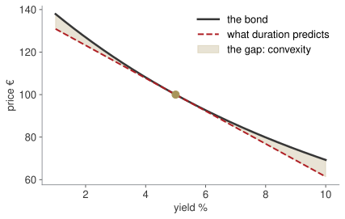

## Homework 4, at the board {.paper background-color="#eceff0"}

[PAPER · 15 minutes]{.kicker}

One of you takes us through it. The memo to the Board member. Would they accept it? Why not?

[Not an exam: the point is to see how you got there.]{.muted}

## Last week, in one minute

::: {.blocks}
::: {.blk .recap}
[Block A]{.blk-letter}What does compounding actually do?[More often always helps, by less each time; the ceiling is $e^{r}$]{.blk-answer}
:::
::: {.blk .recap}
[Block B]{.blk-letter}Which of two quotes is cheaper?[Compare on $EAR = (1 + r/n)^{n} - 1$, never on the nominal rate]{.blk-answer}
:::
::: {.blk .recap}
[Block C]{.blk-letter}What is a future euro worth today?[Discount before adding: $PV = FV/(1+r)^{t}$]{.blk-answer}
:::
::: {.blk .recap}
[Block D]{.blk-letter}Build the line or not?[NPV = +€319k at 9% — accept; IRR is where NPV crosses zero]{.blk-answer}
:::
:::

[Today the same arithmetic prices a bond, and a derivative tells you what a rate rise costs.]{.red}

## Where we are — the last of my five

:::: {.columns}
::: {.column width="56%"}
| Wk | Date | What you can do by hand |
|---|---|---|
| 1–2 | 24 Sep – 1 Oct | algebra, limits, the derivative ✓ |
| 3 | 8 Oct | study, optimise, integrate ✓ |
| 4 | 15 Oct | interest, discounting, NPV ✓ |
| **5** | **22 Oct** | **bonds, duration, convexity** |
:::
::: {.column width="44%"}
**Today closes the loop.**

A bond is an annuity plus a lump sum — last week's arithmetic, nothing new. Duration is a derivative — week 2's. Convexity is a second derivative — week 3's.

Then: a mock of the final's calculus question, in exam conditions.
:::
::::

[The midterm is due Sunday 1 November on Turnitin. Reading week has one optional office hour: bring a draft.]{.red}

## Today's question

::: {.callout-note title="Arno Bikes, a reserve"}
The firm keeps **€1M in bonds** as a cash reserve. The Board has read that rates may rise by a point and asks: **should we be worried?**
:::

By the end of the session you will answer that with two numbers and a sentence.

## Four blocks today {.hub auto-animate=true}

::: {.blocks}
::: {.blk .now data-id="blkA"}
[Block A]{.blk-letter}What is this bond worth?[pricing]{.blk-tool}
:::
::: {.blk .next}
[Block B]{.blk-letter}How much does a rate rise cost?[duration]{.blk-tool}
:::
::: {.blk .next}
[Block C]{.blk-letter}What the straight line misses[convexity]{.blk-tool}
:::
::: {.blk .next}
[Block D]{.blk-letter}The final's calculus question, for real[mock exam]{.blk-tool}
:::
:::

## [Block A]{.section-kicker} Pricing a bond — nothing new {.section-slide background-color="#AF1F25" auto-animate=true}

::: {.blk-fill data-id="blkA"}
:::

## A bond is a promise with dates on it

$$P = \sum_{t=1}^{n} \frac{c \cdot F}{(1+y)^{t}} \;+\; \frac{F}{(1+y)^{n}}$$

An annuity of coupons, plus the face value at the end. You priced both last week.

. . .

A 5-year bond, 4% coupon, face €100, yield 6%:

$$P = 4 \times 4.212364 + 74.73 = 16.85 + 74.73 = €91.58$$

::: {.callout-important title="Bet before we compute"}
Why is it below 100? Answer in one sentence, without arithmetic.
:::

## The rule that follows from the formula

| | |
|---|---|
| coupon **>** yield | **premium** — price above face |
| coupon **=** yield | **par** — price equals face |
| coupon **<** yield | **discount** — price below face |

The bond pays 4% on its face; the market wants 6%. The only way to deliver 6% is to sell it for less than 100.

[Price and yield move in opposite directions. Always, for every bond, with no exceptions.]{.red}

## D1, D2, D3 — price it three ways {.paper background-color="#eceff0"}

[PAPER · drills.md]{.kicker}

12 minutes. Show the annuity part and the redemption part separately. D3 is in the resit's exact format.

## Four blocks today {.hub auto-animate=true}

::: {.blocks}
::: {.blk .done}
[Block A]{.blk-letter}What is this bond worth?[pricing]{.blk-tool}
:::
::: {.blk .now data-id="blkB"}
[Block B]{.blk-letter}How much does a rate rise cost?[duration]{.blk-tool}
:::
::: {.blk .next}
[Block C]{.blk-letter}What the straight line misses[convexity]{.blk-tool}
:::
::: {.blk .next}
[Block D]{.blk-letter}The final's calculus question, for real[mock exam]{.blk-tool}
:::
:::

## [Block B]{.section-kicker} Duration — the slope of that curve {.section-slide background-color="#AF1F25" auto-animate=true}

::: {.blk-fill data-id="blkB"}
:::

## The picture the Board needs

{fig-align="center" width="74%"}

Price against yield is a **curve**, not a line. Duration is the straight line that touches it where you are standing now.

## Duration is a derivative {.clip background-color="#000000"}

<video class="clipvideo" width="1000" height="562" controls muted loop playsinline data-autoplay preload="auto" poster="media/w05_duration_poster.png"><source src="media/w05_duration.mp4" type="video/mp4"></video>

`dP/dy = −772`, and written as a percentage, `D_mod = 7.72`.

## Two durations, and the difference matters

:::: {.columns}
::: {.column width="50%"}
**Macaulay** — the average time to being repaid, weighted by present value:
$$D = \sum_{t} t \cdot \frac{PV(CF_t)}{P}$$
Measured in **years**.
:::
::: {.column width="50%"}
**Modified** — the same thing turned into a sensitivity:
$$D_{\text{mod}} = \frac{D}{1+y} = -\frac{1}{P}\frac{dP}{dy}$$
Measured in **% per 1% of yield**.
:::
::::

. . .

$$\frac{\Delta P}{P} \;\approx\; -D_{\text{mod}} \times \Delta y$$

A 10-year 5% bond at par has `D_mod = 7.72`: a one-point rise in yields costs about **7.7% of its value**.

## Three rules worth memorising

| other things equal | duration |
|---|---|
| longer maturity | **rises** — money comes back later |
| higher coupon | **falls** — more comes back sooner |
| higher yield | **falls** — distant coupons discounted harder |

A zero-coupon bond's Macaulay duration is exactly its maturity: there is nothing to pull the average forward.

::: {.callout-tip title="Board sentence"}
Duration is how many percent you lose for each percent rates rise. It is one number, and it is the first one a Board asks for.
:::

## D5, D6 — compute it, then use it {.paper background-color="#eceff0"}

[PAPER · drills.md]{.kicker}

15 minutes. The weights column must sum to 1. If it does not, stop before computing the duration.

## Four blocks today {.hub auto-animate=true}

::: {.blocks}
::: {.blk .done}
[Block A]{.blk-letter}What is this bond worth?[pricing]{.blk-tool}
:::
::: {.blk .done}
[Block B]{.blk-letter}How much does a rate rise cost?[duration]{.blk-tool}
:::
::: {.blk .now data-id="blkC"}
[Block C]{.blk-letter}What the straight line misses[convexity]{.blk-tool}
:::
::: {.blk .next}
[Block D]{.blk-letter}The final's calculus question, for real[mock exam]{.blk-tool}
:::
:::

## [Block C]{.section-kicker} Convexity — the gap the line misses {.section-slide background-color="#AF1F25" auto-animate=true}

::: {.blk-fill data-id="blkC"}
:::

## Duration says €92.28. The truth is €92.64.

::: {.callout-important title="Bet before we compute"}
The straight-line estimate is wrong. Is it wrong in the holder's favour, or against?
:::

. . .

The curve lies **above** the tangent on both sides. So duration alone **overstates the loss** when yields rise, and **understates the gain** when they fall.

## Watch the gap open {.clip background-color="#000000"}

<video class="clipvideo" width="1000" height="562" controls muted loop playsinline data-autoplay preload="auto" poster="media/w05_convexity_poster.png"><source src="media/w05_convexity.mp4" type="video/mp4"></video>

Small move, small gap. Large move, large gap — and always the same way.

## The second term

$$\frac{\Delta P}{P} \;\approx\; -D_{\text{mod}}\,\Delta y \;+\; \tfrac{1}{2}\,C\,(\Delta y)^{2}$$

| estimate | price at 6% |
|---|---|
| duration only | €92.28 |
| duration + convexity | €92.66 |
| **the truth** | **€92.64** |

Two cents out instead of thirty-six. The half and the square are both easy to drop, and both change the answer.

## What it is worth, in one slide {.statement}

## Between two bonds of the same duration, the more convex one is worth more.

More upside, less downside, for the same first-order risk. You usually pay for it.

## D8, D11 — the reserve, decided {.paper background-color="#eceff0"}

[PAPER · drills.md]{.kicker}

15 minutes. D11 answers the Board's question: a portfolio duration, a euro figure, and a sentence.

## The answer to this morning's question

€400k at `D_mod = 7.72`, €600k at `D_mod = 1.90`:

$$D_{\text{portfolio}} = 0.4(7.72) + 0.6(1.90) = 4.23$$
$$\Delta V \approx -4.23 \times 1\% \times €1{,}000{,}000 = -€42{,}280$$

. . .

"A one-point rise costs the reserve about €42,000, a little over 4%. About three quarters of the exposure sits in the ten-year holding; shortening it would roughly halve the figure. Convexity means the true loss is slightly smaller than this."

## Four blocks today {.hub auto-animate=true}

::: {.blocks}
::: {.blk .done}
[Block A]{.blk-letter}What is this bond worth?[pricing]{.blk-tool}
:::
::: {.blk .done}
[Block B]{.blk-letter}How much does a rate rise cost?[duration]{.blk-tool}
:::
::: {.blk .done}
[Block C]{.blk-letter}What the straight line misses[convexity]{.blk-tool}
:::
::: {.blk .now data-id="blkD"}
[Block D]{.blk-letter}The final's calculus question, for real[mock exam]{.blk-tool}
:::
:::

## [Block D]{.section-kicker} Mock exam — the final's calculus question {.section-slide background-color="#AF1F25" auto-animate=true}

::: {.blk-fill data-id="blkD"}
:::

## Forty minutes, exam conditions {.lab background-color="#2471a3"}

[PAPER · mock_exam.md · no notes, calculator only]{.kicker}

Five items, twenty per cent each, in the form of the real thing:

1. an indefinite integral of a fraction, split term by term
2. a function recovered from its derivative with an initial condition
3. a one-sided limit that factors
4. a limit at infinity
5. a definite integral producing a log

Then we mark it together, and you keep it.

## [Close]{.section-kicker} Handing over {.section-slide background-color="#AF1F25"}

## Take home

1. A bond is an annuity plus a lump sum. Price and yield move in opposite directions.
2. Duration is the slope: how many percent you lose per percent of yield.
3. Longer maturity raises it; a bigger coupon lowers it.
4. Convexity is the curvature the slope misses, and it is always in the holder's favour.

## What happens next

| | |
|---|---|
| **Homework 5** | due Wednesday 28 October, 23:59 — lighter, on purpose |
| **Reading week** | 26–30 October, no class; one optional online office hour |
| **Midterm** | due **Sunday 1 November, 23:59, Turnitin** |
| **Presentations** | week of 2 November |
| **Weeks 6–10** | Vincenzo Nardelli, online: probability, distributions, statistics |

I mark the midterm and stay your reference for it. Everything from weeks 1–3 is what it is built on; everything from weeks 4–5 is the resit's financial-mathematics block and the exam items around it.

[Bring a draft to the office hour. A blank page is a harder conversation than a wrong one.]{.muted}
